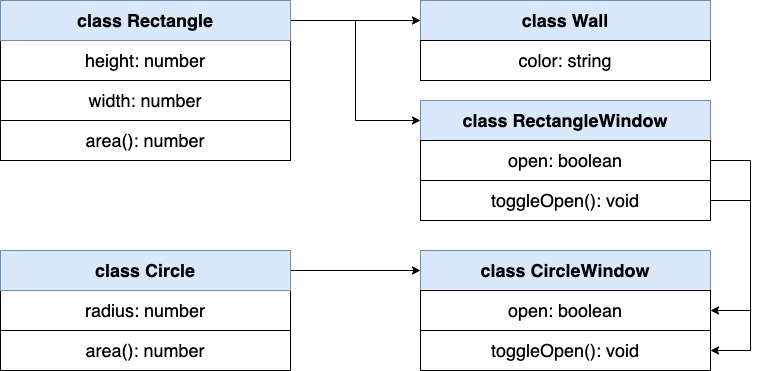
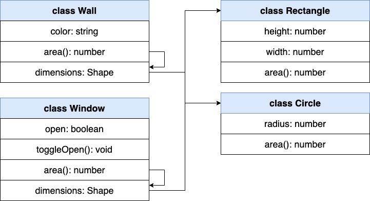
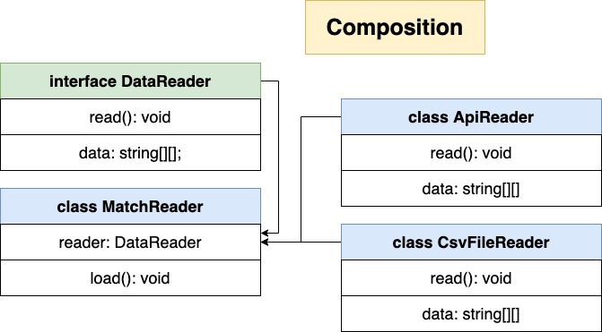

# typescript-complete

Typescript: The Complete Developer's Guide by Stephen Grider

## Folder structure

- 01-getting-started
  - fetchjson
- 02-type-system
  - features
- 03-type-annotations
  - features
    - annotations
- 04-function-object
  - features
    - annotations
- 05-array
  - features
- 06-tuple
  - features
- 07-interface
  - features
- 08-class
  - features
- 09-design-patterns
  - maps: `parcel index.html`
- 10-more-design-patterns
  - sort: `npm start`
    - Inheritance Pattern - abstract class
- 11-reusable-code
  - stats: `npm start`
    - Very strong Composition Pattern!!
    - Also it has inheritance pattern separately
  - stats-static
    - using static method
- 12-advanced-generics
  - features
- 13-web-framework
  - web
    - run server: `json-server -w db.json` or `npm run start:db`
    - run client: `parcel index.html` or `npm run start:parcel`
  - 155-before-refactoring: Before refactoring with composition

# Details

<details open> 
  <summary>Click to Contract/Expend</summary>

## Section 1. Getting Started with Typescript

### 5. Environment Setup

```sh
npm install -g typescript ts-node

tsc --help
tsc test.ts
```

- tsc: compile test.ts to test.js
- ts-node: compiling + executing

#### Visual Studio Code Setting (_Optional_)

1. Add 'code' to path
2. Install Prettier Extension
3. Run pretiier on save
4. Use single quotes with prettier
5. Use two spaces for indentation
6. Use theme to 'Solarized Light

### 6. A First App

```sh
mkdir fetchjson
cd fetchjson
npm init -y
npm install --save axios
```

## Section 2. What is a Type System?

### 12. Types

Type: Easy way to refer to the different properties + functions that a value has

### 13. More on Types

- Primitive Types
  - number
  - string
  - boolean
  - undefined
  - null
  - void
  - symbol
- Object Types
  - functions
  - arrays
  - classes
  - objects

Why do we care about types?

- Types are used by the Typescript Compiler to analyze our code for errors
- Types allow other engineers to understand what values are flowing around our codebase

### 14. Examples of Types

```sh
mkdir features
```

## Section 3. Type Annotations in Action

### 16. Type Annotations and Inference

- Type annotations: We(developers tell Typescript the type)
- Type inference: Typescript guesses the type

### 20. Understanding Inference

```js
let apples: number = 5;
let apples = 5;
```

if declaration and initialization are on the same line, \
Typescript will figure out the type of 'color' for us

- When to use what?
  - Type inference: Always!!!
  - Type annotations
    1. When a function returns the 'any' type and we need to clarify the value
    2. When we declare a variable on one line then initialize it later
    3. When we want a variable to have a type that can't be inferred

## Section 4. Annotations With Functions and Objects

### 26. Inference Around Functions

```js
const add = (a: number, b: number): number => {
  return a + b;
};
⏸⏸⏸
const add = (a: number, b: number) => {
  return a + b;
};
❗️❗️❗️
const add = (a: number, b: number) => {
  a + b;
};
// return void
```

- Arguments: No type inference for arguments!
- Return type: Type inference works out output, **but we won't use it!**

### 28. Void and Never

```js
const throwErrorNever = (message: string): never => {
  throw new Error(message);
};

const throwError = (message: string): void => {
  if (!message) {
    throw new Error(message);
  }
};
```

### 29. Destructuring with Annotations

```js
const logWeather = (forecast: { date: Date, weather: string }): void => {
  console.log(forecast.date);
  console.log(forecast.weather);
};
⬇️⬇️⬇️
const logWeather = ({
  date,
  weather,
}: {
  date: Date;
  weather: string;
}): void => {
  console.log(date);
  console.log(weather);
};
```

### 30. Annotations Around Objects

```js
const { age, firstName }: { age: number, firstName: string } = profile;
const {
  coords: { lat, lng },
}: { coords: { lat: number, lng: number } } = profile;
```

## Section 9. Design Patterns with Typescript

### 51. App Overview

```sh
npm install -g parcel-bundler
```

### 52. Bundling with Parcel

```sh
mkdir maps
cd maps
parcel index.html
# Server running at http://localhost:1234
# ✨  Built in 11.58s.
```

### 54. Generating Random Data

```sh
npm install --save faker
```

> [npm faker](https://www.npmjs.com/package/faker): generate massive amounts of fake data in the browser and node.js

```sh
# We will see this error message a lot during TypeScript course
Cannot find module 'faker' or its corresponding type declarations.ts(2307)
```

### 55. Type Definition Files

```sh
npm install --save-dev @types/faker
# This package contains type definitions for faker
```

[Definitely Typed](https://definitelytyped.org/)

### 56. Using Type Definition Files

> One of the good thing about TypeScript \
> We can link to the definition and could use it as a documentation

```js
class User {
  name: string;
  location: { lat: number, lng: number };
  constructor() {
    this.name = faker.name.firstName();
    // Before initialization, location is still undefined
    // so we cannot use this.location.lat yet
    this.location = {
      lat: parseFloat(faker.address.latitude()),
      lng: parseFloat(faker.address.longitude()),
    };
  }
}
```

### 57. Export Statements inTypescript

Convention for TypeScript is to never use `export default` \
Always use just `export` and `import {}`

### 62. Google Maps Integration

```sh
npm install --save-dev @types/google.maps
```

[/// Triple-Slash Directives](https://www.typescriptlang.org/docs/handbook/triple-slash-directives.html#-reference-types-)

```js
/// <reference types="@types/google.maps" />
```

### 66. Adding Markers

In TypeScript, _class_ can be used two ways

1. to create an object
2. to refer a type definition

```js
import { User } from './User';
import { Company } from './Company';
```

### 71. Showing Popup Windows

[Google Map Marker Info Windows](https://developers.google.com/maps/documentation/javascript/infowindows)

### 73. Optional Implements Clauses

```js
// random color
color: string = `#${Math.floor(Math.random() * 16777215).toString(16)}`;
```

## Section 10. More on Design Patterns

### 76. Configuring the TS Compiler

```sh
tsc --init
```

```json
{
  "rootDir": "./src" /* Specify the root folder within your source files. */,
  "outDir": "./build" /* Specify an output folder for all emitted files. */
}
```

```sh
tsc
tsc -w
```

### 77. Concurrent Compilation and Execution

```sh
npm init -y
npm install --save nodemon concurrently
```

[npm concurrently](https://www.npmjs.com/package/concurrently)

### 81. Two Huge Issues

```js
'X'.charCodeAt(0);
'a'.charCodeAt(0);
```

### 83. Type Guards

- typeof: for Primitive type
  - string, number, boolean, etc.
  - `typeof this.collection === 'string'`
- instanceof: for Object type
  - Array, Object, Date, "Class Name", etc.
  - `this.collection instanceof Array`

### 84. Why is This Bad?

If we have different type of collection such as LinkedList,\
we need to create a new if statement \
What if we have 50 different types of collections? 50 if statements

### 85. Extracting Key Logic

Create Collection Class and have all logic

### 86. Separating Swapping and Comparison

```js
get length(): number {
  return this.data.length;
}
const collection = new NumbersCollection([1, 2, 3]);
collection.length;
```

### 95. Abstract Classes: (Broken still)

Our scenario is perfect to use Abstract Class at this point!!

### 98. Interfaces vs Abstract Classes

- Interfaces
  - Loose coupling
  - Use when we have very different objects that we want to work together
- Inheritance/Abstract Classes
  - Strongly couples classes together
  - Use when we are trying to build up a definition of an object

## Section 11. Reusable Code

### 100. Project Setup

```sh
# /stats
npm init -y
tsc --init
npm install --save nodemon concurrently
```

### 102. Type Definition Files - Again!

```sh
npm install --save-dev @types/node
```

### 117. Variable Types with Generics

<T> : using <T> instead of long name, <TypeOfData> convention of using Generics

### 119. Alternate Refactor

Two way to improve FileReader

1. inheritance: abstract class based
   - **"115. Understanding Refactor #1"** to **"118. Applying a Type to a Generic Class"**
2. composition: interface based
   - **"119. Alternate Refactor"** to **"123. Updating Reader References"**

### 125. More on Inheritance vs Composition

1. Inheritance
   
   - there would be some duplication for two window classes
2. Composition
   
   
   - more independent and easier to use

### 126. A Huge Misconception Around Composition

'Design Patterns' by Erich Gamma, Richard Helm, Ralph Johnson, and John Vivissides

_Favor object composition over class inheritance_

**Delegation**

The meaning of Composition in the book, 'Design Patterns' and bloggers say are different.

1. Composition in the Design Patterns book
   - Delegation: each class does one whole process
2. Composition by bloggers
   - just composing some functions again and again - bad pattern

### 133. One Last Thing!

Using static method......

I think this approach has pros and cons.

index.ts got a lot simpler \
but Summary and MatchReader got strongly wired with the other compsition classes such as HtmlReport and CsvFileReader.\
Probably, Stephen just wanted to show there is another approach we can choose.

## Section 12. Advanced Generics

## Section 13. Let's Build a Web Framework

### 141. Parcel Setup

```sh
npm install -g parcel-bundler
parcel index.html
```

### 142. Framework Structure

1. Model Classes
2. View Classes

### 147. Listener Support

```js
// rather than just using () => void, type it
type Callback = () => void;
```

> `() => {}` means this function will return {} object type, not void

### 148. Storing Event Listeners

```js
export class User {
  // when we don't know what name of key will be used
  events: { [key: string]: Callback[] } = {};
}
```

### 151. Adding JSON Server

```sh
npm install --save axios
npm install -g json-server
```

create db.json file

```json
{ "users": [] }
```

```sh
# Run db server
json-server -w db.json
```

- [npm json-server](https://www.npmjs.com/package/json-server)
- Get a full fake REST API with zero coding in less than 30 seconds (seriously)
  - GET /users
  - GET /users/1
  - POST /users
  - PUT /users/1
  - PATCH /users/1
  - DELETE /users/1

### 157. Re-Integrating Eventing

1. Option #1
   - Accept dependencies as second constructor argument
2. Option #2
   - Only accpet dependenies into constructor defined a static class method to preconfigure user and assign properties afterwards
   - Similar to MatchReader from the last section
3. O, Option #3
   - Only accept properties into constructor
   - Hard code dependencies as class properties

### 160. Options for Adapting Sync

1. Option #1
   - Sync gets function arguments
2. Option #2
   - Sync expects arguments that satisfy interfaces 'Serialize' and 'Deserialize'
   - Serialize
     - Convert data from an object into some save-able format (json)
   - Deserialize
     - Put data on an object using some previously saved data (json)
3. O, Option #3
   - Sync is a generic class to customize the type of 'data' coming into save()
   - The most complicated but it'd be the best approach

### 164. Optional Properties

```sh
tsc --init
# "strict": true,
# These makes significant behavioural difference
```

```js
// before
const { id } = data; // id: number
// after "strict": true,
const { id } = data; // id: numbe | undefinedr
```

Remove tsconfig.json at the moment. I will have it back later and handle issues

### 167. Two Important Rules

1. In Typescript, strings can be types
   ```js
   type BestName = 'stephen';
   ```
2. In JS (and therefore TS), all object keys are strings
   ```js
   const color = {
     red: 'red',
     5: 'red',
   };
   ```

### 168. An Advanced Generic Constraint

```js
export class Attributes<T> {
  constructor(private data: T) {}
  get<K extends keyof T>(key: K): T[K] {
    return this.data[key];
  }
}
```

</details>

## TODO after this course

- Update Birthday Notifier with CsvFileReader.ts in 11-reusable-code
